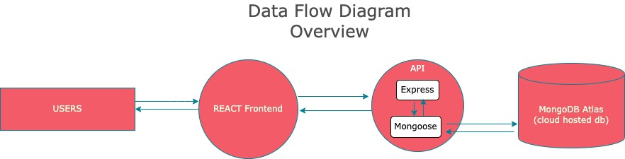
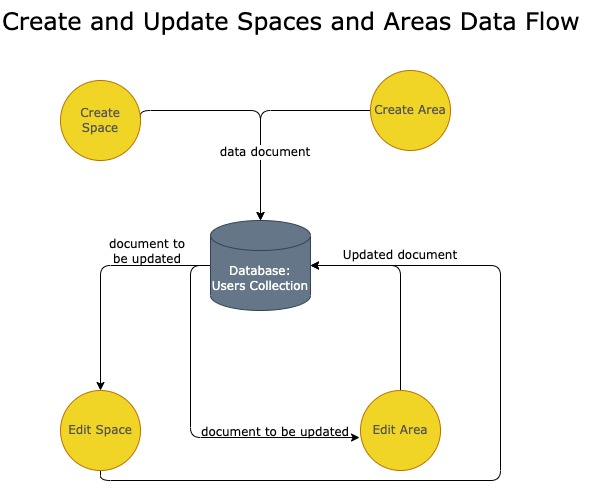
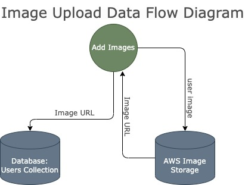

## Data Flow Diagrams

The primary ways data flows within the application are standard user registration/login actions, full crud for a collection spaces (larger areas of a property ie. front yard, back yard) and full crud operations for areas (sub-sections of a space ie. northwest flower bed, verge). Both spaces and areas allow for user provided name, description and notes, stored in a the users collection on the database. Additionally the app allows for user uploaded images of spaces and areas which are uploaded to an AWS image server which responds with an image URL. The returned image URL is then stored appropriately in the users collection on the database. 

###### Data flow: Overview  
   

###### Data flow: Full View

   

###### Data flow: Login

   

###### Data flow: View Spaces and Areas

   

###### Data flow: Create/Update Spaces and Areas

   

###### Data flow: Add Images

