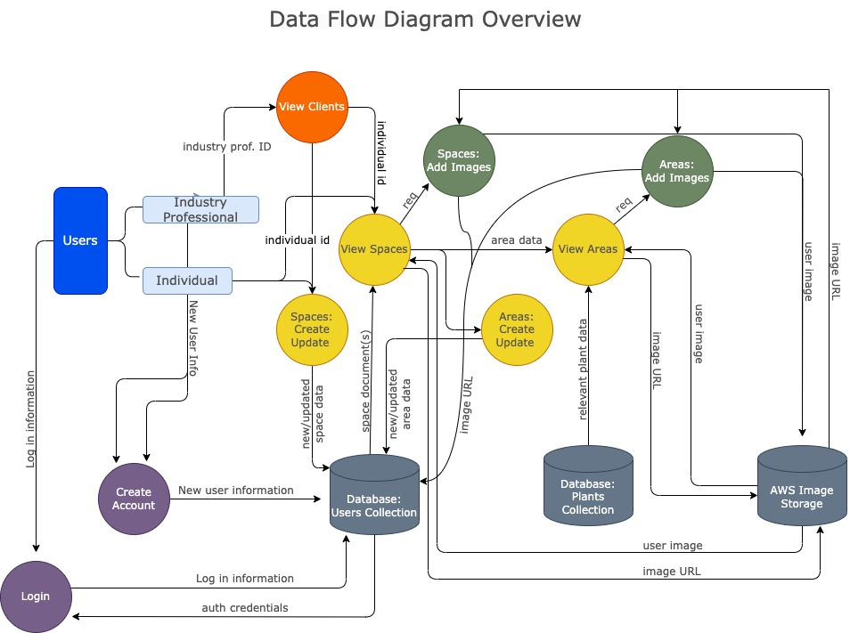
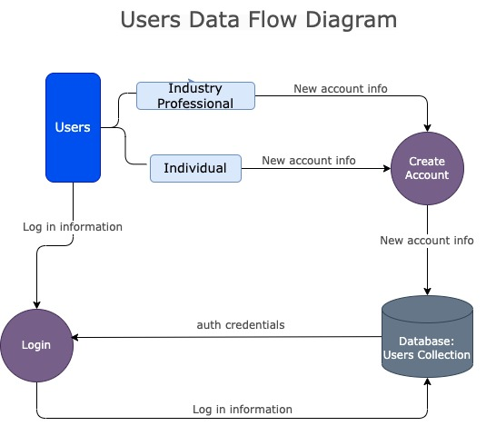

# T3A2-A - Full Stack App (Part A)

## Garden Tracker App
### Joshua Davis, Kal Fung, Benjamin Campbell

#### **README Contents:**
1. [Project Purpose](#Project-Purpose)  
1. [Functionality and Features](#Functionality-and-Features)  
1. [Target Audience](#Target-Audience)  
1. [Tech Stack](#Tech-Stack)  
1. [Data Flow Diagrams](#Data-Flow-Diagrams)  
1. [Application Architecture Diagrams](#Application-Architecture-Diagrams)  
1. [User Stories](#User-Stories)  
1. [Project Management](#Project-Management)  

### Purpose
So you’ve just spent a weekend and a small fortune to landscape your front yard and now you can’t remember the names of any of your new plants, let alone their care needs and schedules. Sure you could save the small plastic information tags for every plant in a ziplock bag, toss it in a drawer in your garage and hope to find it before your new babies have withered away… Or you could start using ***Plantastic***!  

The intended purpose of the <Garden Tracker> app is to create an organized collection of landscaped areas or plants so a user may access information, care instructions and schedules in one central location. It is intended as both a means to concentrate relevant information as well as to log and schedule care events such as watering, feeding and fertilizing. Regardless of wether the user is an individual garden owner or a landscape professional its intent is to promote a meaningful connection to a users landscape, empowering them to become actively involved with the success of the flora that surrounds them.

 

### Functionality and Features
- Users can navigate to pages for individual plants in any area of their property
- Users can view watering, feeding and mulching schedules for any given plant
- Users can view all their plants filtered by e.g. edible/ornamental, due for watering/feeding
- Users can edit or create new areas

 

### Target Audience
Our application is primarily targeted towards individuals wishing to establish and maintain a new garden, or to catalogue and maintain an already established garden. These individuals live in rural, semi-rural or even metropolitan areas and the responsibility for garden maintenance could be shared between multiple individuals. With this in mind, the target audience groups are best summarised as:
- An aspiring gardener/s wanting to establish a new garden
- An existing gardener/s wanting to document and catalogue the plants in their current garden
- A home or apartment owner/s in a metropolitan setting wanting to keep a record of the plants in their home and details of their upkeep  

Additionally, we are also targeting our application towards the owners of small landscaping businesses. They can use the application’s functionality to create a new client and input garden information as part of their service package.
The common attribute of individual 1, 2 and 3, as well as the small business owner, is that they all want an efficient, user-friendly and helpful application to document not only their plants, but also details on the plants’ upkeep and maintenance.
Note: While our application is geared towards the hobbyist or casual gardener, the scope of the application can still meet the needs of even the more seasoned gardener. The data model we have chosen is flexible and individual enough to allow users to input as many planting areas in as many planting spaces as needed.

 

### Tech Stack
We used the MERN stack as a web development framework for our application. This consists of:
- MongoDB — a document-oriented, NoSQL database program which uses - JSON-like documents with optional schemas
- Express — a Node web application framework primarily used for routing and middleware
- React — a JavaScript library, maintained by Meta, for developing the user interfaces and front end components of our application
- Node — allows developers to create server-side tools and applications, but we used it with Express as a web framework to enhance its functionality  

In addition to these core technologies, we also used:
- Mongoose — provides functionality for MongoDB object modelling and validation
- Render — deployment platform for our back end
- Netlify - deployment platform for our front end
- Vitest and testing-library — front end unit testing
- Supertest — back end, API unit testing
- HTML
- CSS

 

### Data Flow Diagrams

The primary ways data flows within the application are:
- standard user registration/login actions
- full crud for a collection spaces (larger areas of a property ie. front yard, back yard) 
- full crud operations for areas (sub-sections of a space ie. northwest flower bed, verge).

Both spaces and areas allow for user provided names, descriptions and notes which are stored in the users collection on the database. The app also allows for user uploaded images of spaces and areas which are uploaded to an AWS image server, which responds with an image URL. The returned image URL is then stored appropriately in the users collection on the database. 

  

   

  

   

  

   

  

   

  

   

  

 
 

### Application Architecture Diagram

 

 

### User Stories:

 

### Project Management
For project management approach we are using Agile methodologies aided by a Trello project boards. Task cards are created, assigned and given a due date in order to keep progress on track and reduce any disruption of creation flow. Additionally communication on a group discord, casual individual daily standups are used to keep project perspective and adapatability to changing needs of individuals and the project. Members take turns participating in a more formal group daily standup on the cohorts discord channel.

 

